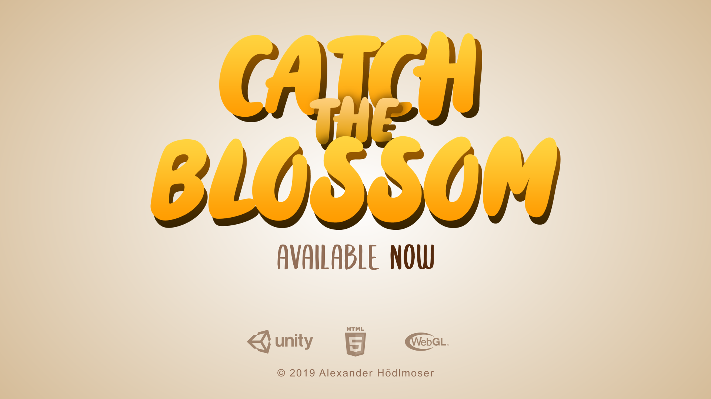
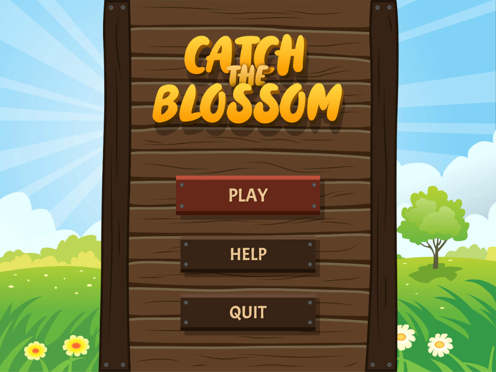
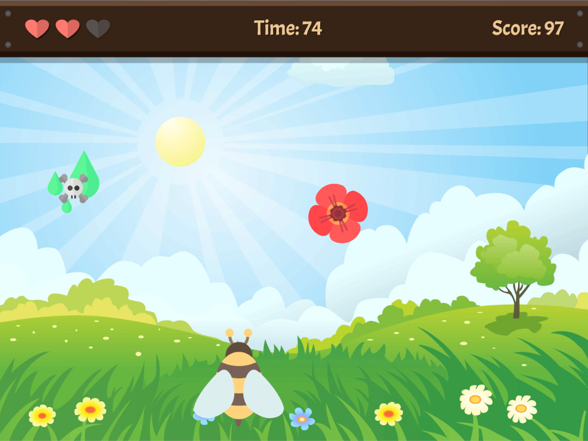
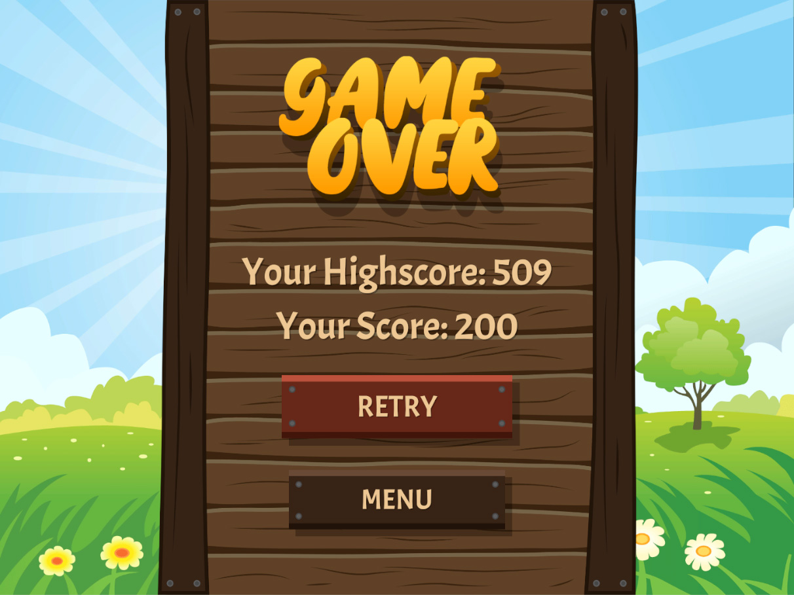
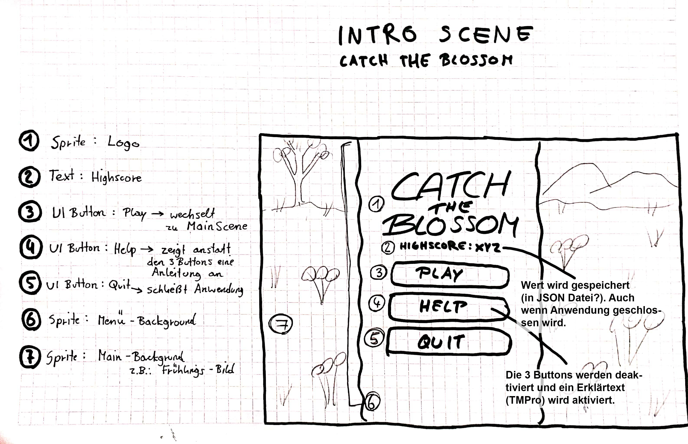
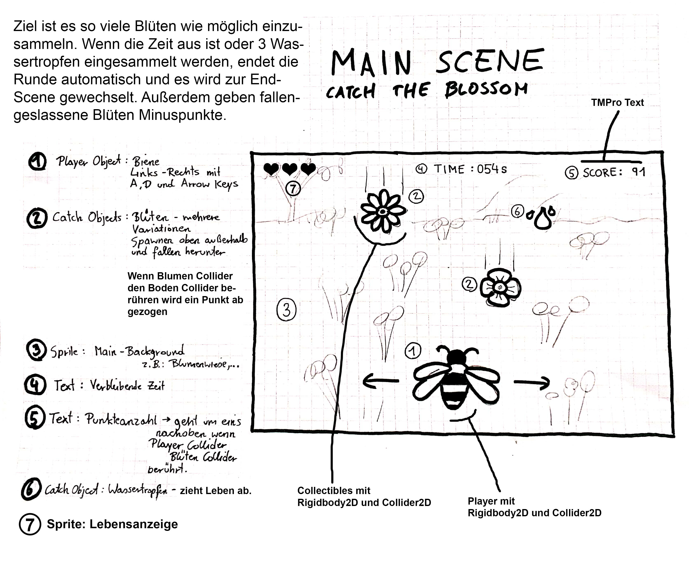
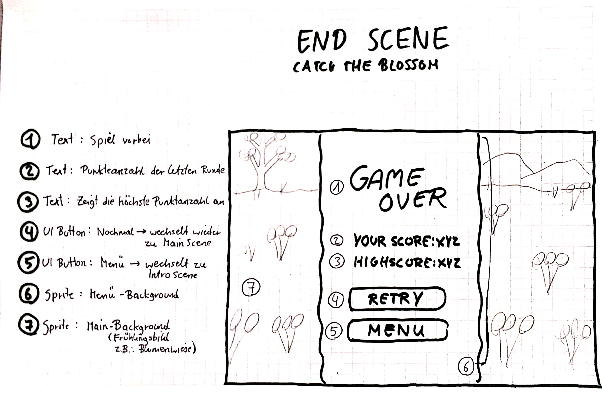

# minigame1-alexh

* **Working Title:** Catch The Blossom
* **Progress:** 100% as of June 15 2019

### Development Platform

  * OS: Windows 10 Version 1803
  * Unity: Version 2018.2.14f1
  * Visual Studio: Version 15.9.10
  * Scripting Runtime Version: .NET 3.5 Equivalent
  * API Compatibility Level: .NET 2.0 Subset

### Target Platform
  * WebGL @ 1024x768

### Description 

"Catch The Blossom" is about a bee that has to collect blossoms in order to pollinate them. You control the bee and have to catch the dropping blossoms to gain points that count towards the score. If a blossom falls to the ground without catching it, points will be subracted from the total score. But there are also raindrops falling from the sky, which drain some health from the bee. Also be aware of the deadly poison that is dropping down. If you touch one of those drops the bee will instantly die, so strictly avoid them! One round lasts for a maximum of 2 minutes, in which you have the chance to collect as many points as you can to achieve a great highscore!

### Gameplay Trailer

[Watch the Gameplay Trailer for Catch The Blossom on YouTube](https://www.youtube.com/watch?v=OXeNWKNiifo)

### Controls

**Move the bee left/right:** A/D or ←/→

### Final Look

- Gameplay Screenshots

### Lessons learned
- How to start concepting a game
- Working with Unity 2D Colliders and Rigidbodies
- Working with Unity Inputs (Horizontal Axis)
- Working with Scriptable Objects in Unity
- Methods of code refactoring in C#

### Third Party Material
- PersistableSO.cs Script by [Neil North](https://github.com/northy179)
- Sunflower, Poppy, Daisy, Hydrangea, Wallflower, Skull and Drop Icons made by [Freepik](https://www.freepik.com/) from [www.flaticon.com](https://www.flaticon.com/)
- [Holyfat](https://www.dafont.com/holyfat.font) Font by [Weape Design](https://www.dafont.com/weape-design.d7167)
- [Acme](https://fonts.google.com/specimen/Acme) Font by [Huerta Tipográfica](https://huertatipografica.com/en)
- [Subscriber](https://www.dafont.com/de/subscriber.font) Font by [Alit Design](https://www.dafont.com/de/alit-suarnegara.d6398) (used in Trailer)
- ["The Lights" Trailer Music](https://www.youtube.com/watch?v=74sLXK3hfdg) by [Whitesand](https://www.youtube.com/channel/UCe96JG5gdgSRtmqStx0isXA)

##### © 2019 by Alexander Hödlmoser